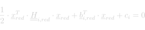

# Constraint

## Formulation

The local formulation of the constraint's quadratic equation reads :
<center>
  
  <!-- Raw LaTeX : \frac{1}{2} \cdot \underline{x}_{red}^{T} \cdot \underline{\underline{H}}_{i,red} \cdot \underline{x}_{red} + \underline{b}_{i,red}^{T} \cdot \underline{x}_{red} + c_{i} = 0 -->
</center>

where :
- <em><span style="border-bottom: double">H</span><sub>i,red</sub></em> : Symmetric matrix.
- <em><span style="text-decoration : underline">b</span><sub>i,red</sub></em> : Column vector.
- <em>c<sub>i</sub></em> : Scalar value.

## Custom Constraint Type

### Custom Quadratic Constraint Type

Create a public class which inherits from the [`IQuadraticConstraintType`](xref:BRIDGES.Solvers.GuidedProjection.Interfaces.IQuadraticConstraintType) interface and declare the three properties required to implement the interface. These three properties correspond to the local symmetric matrix <em><span style="border-bottom: double">H</span><sub>i,red</sub></em>, the column vector <em><span style="text-decoration : underline">b</span><sub>i</sub></em> and the scalar coefficient <em>c<sub>i</sub></em> necessary to define a linear constraint from vector <em><span style="text-decoration : underline">x</span><sub>red</sub></em>.

```cs
public class CostumQuadraticConstraintName : IQuadraticConstraintType
{
  /// <inheritdoc/>
  public DictionaryOfKeys LocalHi { get; }

  /// <inheritdoc/>
  public Dictionary<int, double> LocalKi { get; }

  /// <inheritdoc/>
  public double Si { get; }

  ...

}
```

Then, in the class constructor, instanciate and initialise the values of the properties. The parameters of the constructor should provide the information needed to fill in <em><span style="border-bottom: double">H</span><sub>i,red</sub></em>,  <em><span style="text-decoration : underline">b</span><sub>i</sub></em> and <em>c<sub>i</sub></em>.

```cs

  public CostumQuadraticConstraintName()
  {
    ...
  }

```

### Cusoum Linearised Constraint Type

Create a public class which inherits from the [`ILinearisedConstraintType`](xref:BRIDGES.Solvers.GuidedProjection.Interfaces.ILinearisedConstraintType) interface and declare the three properties required to implement the interface. These three properties correspond to the local symmetric matrix <em><span style="border-bottom: double">H</span><sub>i,red</sub></em>, the column vector <em><span style="text-decoration : underline">b</span><sub>i</sub></em> and the scalar coefficient <em>c<sub>i</sub></em> necessary to define a linear constraint from vector <em><span style="text-decoration : underline">x</span><sub>red</sub></em>.

```cs
public class CostumLinearisedConstraintName : ILinearisedConstraintType
{
  /// <inheritdoc/>
  public DictionaryOfKeys LocalHi { get; }

  /// <inheritdoc/>
  public Dictionary<int, double> LocalKi { get; }

  /// <inheritdoc/>
  public double Si { get; }

  ...

}
```

Then, leave the class constructor empty.

```cs

  public CostumLinearisedConstraintName()
  {
    ...
  }

```

Finally, declare an update method for the properties of the costum linearised constraint type. The parameter xReduced of the method contains the updated value of the variables'components. The order of the components in xReduced follows the order in which the variables where are added in the ensuing `LinearisedConstraint`. This method will be called at each iteration during the solving process with the updated values of xReduced.

```cs

  void UpdateLocal(double[] xReduced);
  {
    /* Update the values of the properties using xReduced */
  }

```

## Implemented Constraint Types

### Implemented Quadratic Constraints Types

The following energies can be found in `BRIDGES.Solvers.GuidedProjection.QuadraticConstraintTypes` namespace.

**Coherent Length**

Constraint enforcing a scalar variable <em>l</em> to match with the distance between two point variables, <em><span style="text-decoration : underline">p</span><sub>i</sub></em> and <em><span style="text-decoration : underline">p</span><sub>j</sub></em>. For more information, see the dedicated [page](./QuadraticConstraintTypes/CoherentLength.md).

**Lower Bound**

Constraint enforcing a value variable <em>l</em> to be higher than a lower bound <em>σ</em> using a dummy value variable <em>λ</em>. For more information, see the dedicated [page](./QuadraticConstraintTypes/LowerBound.md).

**Upper Bound**

Constraint enforcing a value variable <em>l</em> to be lower than an upper bound <em>σ</em> using a dummy value variable <em>λ</em>. For more information, see the dedicated [page](./QuadraticConstraintTypes/UpperBound.md).

**Vector Length**

Constraint enforcing a vector variable <em><span style="text-decoration : underline">v</span></em> to have a given length <em>l</em> (computed with euclidean norm). For more information, see the dedicated [page](./QuadraticConstraintTypes/VectorLength.md).

### Implemented Linearised Constraint Types

The following energies can be found in `BRIDGES.Solvers.GuidedProjection.LinearisedConstraintTypes` namespace.

*No linearised constraints are defined yet*
