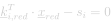

# Energies

## Formulation

The local formulation of the energy's linear equation reads :
<center>
  
  <!-- Raw LaTeX : \underline{k}_{i,red}^{T} \cdot \underline{x}_{red} - s_{i} = 0 -->
</center>

where :
- <em><span style="text-decoration : underline">k</span><sub>i,red</sub></em> : Column vector.
- <em>s<sub>i</sub></em> : Scalar value.


## Custom Energy Type

Create a public class which inherits from the [`IEnergyType`](xref:BRIDGES.Solvers.GuidedProjection.Interfaces.IEnergyType) interface and declare the two properties required to implement the interface. These two properties correspond to the local column vector <em><span style="text-decoration : underline">k</span><sub>i,red</sub></em> and the scalar coefficient <em>s<sub>i</sub></em> necessary to define a linear constraint from the local vector <em><span style="text-decoration : underline">x</span><sub>red</sub></em>.


```cs
public class CostumEnergyName : IEnergyType
{
  /// <inheritdoc/>
  public Dictionary<int, double> LocalKi { get; }

  /// <inheritdoc/>
  public double Si { get; }

  ...

}
```

Then, in the class constructor, instanciate and initialise the values of the properties. The parameters of the constructor should provide the information needed to fill in <em><span style="text-decoration : underline">k</span><sub>i,red</sub></em> and <em>s<sub>i</sub></em>.

```cs

  public CostumEnergyName()
  {
    ...
  }

```

## Implemented Energy Types

The following energies can be found in `BRIDGES.Solvers.GuidedProjection.EnergyTypes` namespace.

**Segment Orthogonality**

Energy enforcing a segment defined from two point variables, <em><span style="text-decoration : underline">p</span><sub>i</sub></em> and <em><span style="text-decoration : underline">p</span><sub>j</sub></em>, to be orthogonal to a constant direction <em><span style="text-decoration : underline">v</span><sub>dir</sub></span></em>. For more information, see the dedicated [page](./EnergyTypes/SegmentOrthogonality.md).

**Segment Parallelity**

Energy enforcing a segment defined from two point variables, <em><span style="text-decoration : underline">p</span><sub>i</sub></em> and <em><span style="text-decoration : underline">p</span><sub>j</sub></em>, to be parallel to a constant direction <em><span style="text-decoration : underline">v</span><sub>dir</sub></span></em>. For more information, see the dedicated [page](./EnergyTypes/SegmentParallelity.md).
