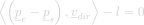
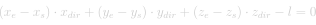
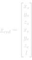
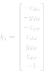
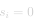

# Segment Parallelity

#### Definition

The `SegmentParallelity` energy ensures that a segment, defined from two point variables <em>ps</em> and <em>pe</em>, is parallel to a fixed direction, defined from a unit vector <em>vdir</em>.

#### Requirements

To use the `SegmentParallelity` energy the following variables must be defined in the solver:
- <em>ps</em> : Point variable corresponding to the start of the segment.
- <em>pe</em> : Point variable corresponding to the end of the segment.
- <em>l</em> : Scalar variable representing the length of the segment.

The target direction <em>vdir</em> is not add as a variable of the *Guided Projection Algorithm*. It is specified at initialisation of the constraint.

#### Suggestions

To use this constraint, a length variable must be used. The definition of length variables should always be coupled with the [`CoherentLength`](../QuadraticConstraintTypes/CoherentLength.md) constraint to ensure that the length variable accurately represents the distance between the two points defining the segment, <em>ps</em> and <em>pe</em> in the current context.

## Energy Formulation

The formulation of the `SegmentParallelity` energy reads :

  
  <!--  Raw LaTeX : \left < \left ( \underline{p}_{e} - \underline{p}_{s} \right ) , \underline{v} \right > - l = 0 -->
    

which, in the case where the points are from a three-dimensional space, develops to :

  
  <!--  Raw LaTeX : \left ( x_{e} - x_{s} \right ) \cdot x_{dir} + \left ( y_{e} - y_{s} \right ) \cdot y_{dir} + \left ( z_{e} - z_{s} \right ) \cdot z_{dir} - l = 0 -->
    

Hence, the local problem can be expressed as follow:

  
  <!-- Raw LaTeX : \underline{x}_{red} = \begin{bmatrix} x_{s} \\ y_{s} \\ z_{s} \\ x_{e} \\ y_{e} \\ z_{e} \\ l \\ \end{bmatrix} -->
  ,
  
  <!-- Raw LaTeX : \underline{k}_{i} = \begin{bmatrix} -x_{dir} \\ -y_{dir} \\ -z_{dir} \\ x_{dir} \\ y_{dir} \\ z_{dir} \\ -1 \\ \end{bmatrix} -->
  ,
  
  <!-- Raw LaTeX : s_{i} = 0 -->
    

In the framework, the `SegmentParallelity` energy is not restricted to the three-dimensional case. The dimension of the space is given at initialisation of the constraint thanks to the target direction vector <em>vdir</em>.
