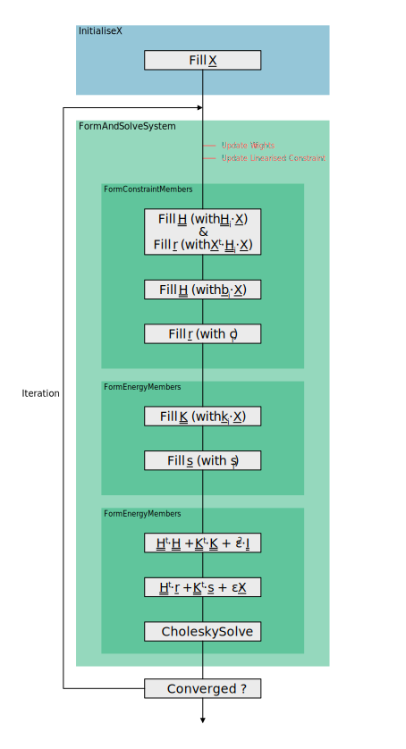

# Introduction

The solver presented in this article is based on [Form-finding with polyhedral meshes made simple](http://dx.doi.org/10.1145/2601097.2601213) by Tang et al.

In the solver, three types of elements can be defined:
- Variables : Values that are optimized by the solver.
- Energies : Objective for the solver whose expression is a linear equation.
- Constraints : Objective for the solver whose expression is a quadratic equation.

## Variables

The variables of the Guided Projection Algorithm (GPA) are stored in a column vector, denoted as <em>X</em> in the article.  The variables can be geometrically significant (like point coordinates or face normals), meaningful with regard to the constraints (target lengths or forces), or simply dummy elements (as for inequalities).

To facilitate the manipulation and the recognition of the variables, variables are organized into `VariableSet`. A `VariableSet` represents a span of the final vector <em>X</em>  and contains elements of the same kind with, with the same dimension.

The final vector <em>X</em> corresponds to the successive concatenation of the `VariableSet`. The order of the `VariableSet` in <em>X</em> follows that of the declaration.

## Optimisation Objectives

The vector <em>X</em>, which contains the variables, can quickly becomes long. Hence expressing the objectives directly on <em>X</em> directly would become cumbersome, especially in terms of index management.

To evade this issue, the objectives (`Energy` and `Constraint`) are defined locally on a reduced vector <em>xred</em>. The <em>xred</em> vector contains only the necessary variables contained in <em>X</em>. The optimisation goals are first locally expressed using matrices and vectors matching the size of <em>xred</em>.

During the iteration, the locally defined members based on <em>xred</em> are *completed* to be expressed on <em>X</em>.

### Energies

In the reference paper, an *energy* refers to an optimisation objective whose expression is a linear equation. They are organized into two elements:
- `EnergyType` : Contains the values of <em>ki</em> and <em>ci</em> to apply to the local variables in <em>xred</em>.
- `Energy` : Contains the list of variables composing <em>xred</em> and an `EnergyType` defining the local members for the linear equation .

For more information on energies, refer to the dedicated [page](./Energy.md).

### Constraints

In the reference paper, an *constraints* refers to an optimisation objective whose expression is a quadratic equation. Two categories of constraints can be defined.

#### Quadratic Constraint

A *quadratic constraint* is expressed through a quadratic equation whose members (<em>Hi,red</em>, <em>bi,red</em> and <em>ci</em>) are constant. In a similar fashion, quadratic constraint are organized into two elements:

- `QuadraticConstraintType` :  Contains the values of <em>Hi,red</em>, <em>bi,red</em> and <em>ci</em> to apply to the local variables in <em>xred</em>.
- `QuadraticConstraint` : Contains the list of variables composing <em>xred</em> and a `QuadraticConstraintType` defining the local members for the quadratic equation.

#### Linearised Constraint

A *linearised constraint* is expressed through a quadratic equation whose members (<em>Hi,red</em>, <em>bi,red</em> and <em>ci</em>) depend on the local variables in <em>xred</em>. Hence the members have to be computed at each iteration. In a similar fashion, linearised constraint are organized into two elements:

- `LinearisedConstraintType` :  Contains the values of <em>Hi,red</em>, <em>bi,red</em> and <em>ci</em> to apply to the local variables in <em>xred</em> and the method to update the members.
- `LinearisedConstraint` : Contains the list of variables composing <em>xred</em> and a `LinearisedConstraintType` defining the local members for the quadratic equation.

For more information on constraints, refer to the dedicated [page](./Constraint.md).

## Implementation

### Solving Process

  
    

## Example

For detailed examples, refer to the dedicated [page](./Examples/Summary.md).
