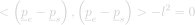
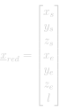
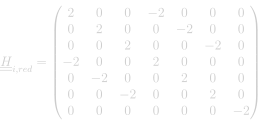
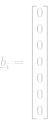
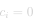

# Coherent Length

#### Definition

The `CoherentLength` quadratic constraint ensures that a segment length, defined as the distance between two point variables, <em>ps</em> and <em>pe</em>, is equal to a scalar variable <em>l</em>, representing the length of the segment. In other words, the constraint updates the scalar variable and the two points variables so that the distance between the points equals the length.

#### Requirements

To use the `CoherentLength` constraint the following variables must be defined in the solver:
- <em>ps</em> : Point variable corresponding to the start of the segment.
- <em>pe</em> : Point variable corresponding to the end of the segment.
- <em>l</em> : Scalar variable representing the length of the segment.

#### Suggestions

When vertices and segment lengths are both added as variables in the solver, the `CoherentLength` constraint must be added to the solver. Otherwise, any energy or constraint using the length variables will produce unreliable results.

## Constraint Formulation

The formulation of the `CoherentLength` constraint reads :

  
  <!-- Raw LaTeX : < \left ( \underline{p}_{e} - \underline{p}_{s} \right ) , \left ( \underline{p}_{e} - \underline{p}_{s} \right ) > - l^{2} = 0 -->
    

Hence, in the case where the points are from a three-dimensional space, the local problem can be expressed as follow:

  
  <!-- Raw LaTeX : \underline{x}_{red} = \begin{bmatrix} x_{s} \\ y_{s} \\ z_{s} \\ x_{e} \\ y_{e} \\ z_{e} \\ l \\ \end{bmatrix} -->
  ,
  
  <!-- Raw LaTeX : \underline{\underline{H}}_{i,red} = \begin{pmatrix} 2 & 0 & 0 & -2 & 0 & 0 & 0 \\ 0 & 2 & 0 & 0 & -2 & 0 & 0 \\ 0 & 0 & 2 & 0 & 0 & -2 & 0 \\ -2 & 0 & 0 & 2 & 0 & 0 & 0 \\ 0 & -2 & 0 &  0 & 2 & 0 & 0 \\ 0 & 0 & -2 & 0 & 0 & 2 & 0 \\ 0 & 0 & 0 & 0 & 0 & 0 & -2 \\ \end{pmatrix} -->
  ,
  
  <!-- Raw LaTeX : \underline{b}_{i} = \begin{bmatrix} 0 \\ 0 \\ 0 \\ 0 \\ 0 \\ 0 \\ 0 \\ \end{bmatrix} -->
  ,
  
  <!-- Raw LaTeX : c_{i} = 0 -->
    

In the framework, the `CoherentLength` constraint is not restricted to the three-dimensional case. The dimension of the space is given at initialisation of the constraint.
