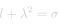
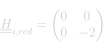
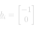
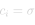

# Upper Bound

#### Definition

The `UpperBound` quadratic constraint ensures that a scalar value <em>l</em> remains under a given limit <em>σ</em>.

#### Requirements

To use the `UpperBound` constraint the following variables must be defined in the solver:
- <em>l</em> : Scalar variable being constrained.
- <em>λ</em> : Scalar variable used as dummy value.

#### Suggestions

No remarks.

## Constraint Formulation

The formulation of the `UpperBound` quadratic constraint reads :

  
  <!-- Raw LaTeX : l = \sigma + \lambda ^{2} -->
    

Hence, the local problem can be expressed as follow:

  
  <!-- Raw LaTeX : \underline{x}_{red} = \begin{bmatrix} l \\ \lambda \\ \end{bmatrix} -->
  ,
  
  <!-- Raw LaTeX : \underline{\underline{H}}_{i,red} = \begin{pmatrix} 0 & 0 \\ 0 & 2 \\ \end{pmatrix} -->
  ,
  
  <!-- Raw LaTeX : \underline{b}_{i} = \begin{bmatrix} -1 \\ 0 \\ \end{bmatrix} -->
  ,
  
  <!-- Raw LaTeX : c_{i} = \sigma -->
    

