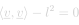
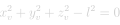
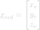
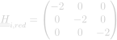
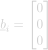
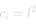

# Vector Length

#### Definition

The `VectorLength` quadratic constraint ensures that a vector variable <em>v</em> has a length equal to a given scalar value <em>l</em>.

#### Requirements

To use the `VectorLength` constraint the following variables must be defined in the solver:
- <em>v</em> : Vector variable with a finite number of coordinates.

#### Suggestions

No remarks.

## Constraint Formulation

The formulation of the `UpperBound` quadratic constraint reads :

  
  <!-- Raw LaTeX : \left < \underline{v} , \underline{v} \right > - l^{2} = 0 -->
    

which, in the case where the vector is from a three-dimensional space, develops to :

  
  <!-- Raw LaTeX : x_{v}^{2} + y_{v}^{2} + z_{v}^{2} - l^{2} = 0 -->
    

Hence, the local problem can be expressed as follow:

  
  <!-- Raw LaTeX : \underline{x}_{red} = \begin{bmatrix} x_{v} \\ y_{v} \\ z_{v} \\ \end{bmatrix}  -->
  ,
  
  <!-- Raw LaTeX : \underline{\underline{H}}_{i,red} = \begin{pmatrix} -2 & 0 & 0 \\ 0 & -2 & 0 \\ 0 & 0 & -2 \\ \end{pmatrix} -->
  ,
  
  <!-- Raw LaTeX : \underline{b}_{i} = \begin{bmatrix} 0 \\ 0 \\ 0 \\ \end{bmatrix} -->
  ,
  
  <!-- Raw LaTeX : c_{i} = l^{2} -->
    

In the framework, the `VectorLength` constraint is not restricted to the three-dimensional case. The dimension of the space is given at initialisation of the constraint.
